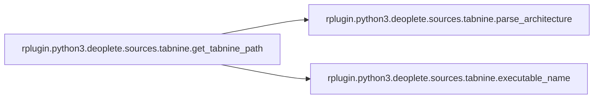

# Rplugin Python3

[_Documentation generated by Documatic_](https://www.documatic.com)

<!---Documatic-section-Codebase Structure-start--->
## Codebase Structure

<!---Documatic-block-system_architecture-start--->
```mermaid
None
```
<!---Documatic-block-system_architecture-end--->

# #
<!---Documatic-section-Codebase Structure-end--->

<!---Documatic-section-rplugin.python3.deoplete.sources.tabnine.parse_semver-start--->
## [rplugin.python3.deoplete.sources.tabnine.parse_semver](3-rplugin_python3.md#rplugin.python3.deoplete.sources.tabnine.parse_semver)

<!---Documatic-section-parse_semver-start--->
<!---Documatic-block-rplugin.python3.deoplete.sources.tabnine.parse_semver-start--->
<details>
	<summary><code>rplugin.python3.deoplete.sources.tabnine.parse_semver</code> code snippet</summary>

```python
def parse_semver(s):
    try:
        return [int(x) for x in s.split('.')]
    except ValueError:
        return []
```
</details>
<!---Documatic-block-rplugin.python3.deoplete.sources.tabnine.parse_semver-end--->
<!---Documatic-section-parse_semver-end--->

# #
<!---Documatic-section-rplugin.python3.deoplete.sources.tabnine.parse_semver-end--->

<!---Documatic-section-rplugin.python3.deoplete.sources.tabnine.get_tabnine_path-start--->
## [rplugin.python3.deoplete.sources.tabnine.get_tabnine_path](3-rplugin_python3.md#rplugin.python3.deoplete.sources.tabnine.get_tabnine_path)

<!---Documatic-section-get_tabnine_path-start--->


### Object Calls

* [rplugin.python3.deoplete.sources.tabnine.parse_architecture](3-rplugin_python3.md#rplugin.python3.deoplete.sources.tabnine.parse_architecture)
* [rplugin.python3.deoplete.sources.tabnine.executable_name](3-rplugin_python3.md#rplugin.python3.deoplete.sources.tabnine.executable_name)

<!---Documatic-block-rplugin.python3.deoplete.sources.tabnine.get_tabnine_path-start--->
<details>
	<summary><code>rplugin.python3.deoplete.sources.tabnine.get_tabnine_path</code> code snippet</summary>

```python
def get_tabnine_path(binary_dir):
    SYSTEM_MAPPING = {'Darwin': 'apple-darwin', 'Linux': 'unknown-linux-musl', 'Windows': 'pc-windows-gnu'}
    versions = os.listdir(binary_dir)
    versions.sort(key=parse_semver, reverse=True)
    for version in versions:
        triple = '{}-{}'.format(parse_architecture(platform.machine()), SYSTEM_MAPPING[platform.system()])
        path = os.path.join(binary_dir, version, triple, executable_name('TabNine'))
        if os.path.isfile(path):
            return path
```
</details>
<!---Documatic-block-rplugin.python3.deoplete.sources.tabnine.get_tabnine_path-end--->
<!---Documatic-section-get_tabnine_path-end--->

# #
<!---Documatic-section-rplugin.python3.deoplete.sources.tabnine.get_tabnine_path-end--->

<!---Documatic-section-rplugin.python3.deoplete.sources.tabnine.parse_architecture-start--->
## [rplugin.python3.deoplete.sources.tabnine.parse_architecture](3-rplugin_python3.md#rplugin.python3.deoplete.sources.tabnine.parse_architecture)

<!---Documatic-section-parse_architecture-start--->
<!---Documatic-block-rplugin.python3.deoplete.sources.tabnine.parse_architecture-start--->
<details>
	<summary><code>rplugin.python3.deoplete.sources.tabnine.parse_architecture</code> code snippet</summary>

```python
def parse_architecture(arch):
    if arch == 'AMD64':
        return 'x86_64'
    elif arch == 'arm64':
        return 'aarch64'
    else:
        return arch
```
</details>
<!---Documatic-block-rplugin.python3.deoplete.sources.tabnine.parse_architecture-end--->
<!---Documatic-section-parse_architecture-end--->

# #
<!---Documatic-section-rplugin.python3.deoplete.sources.tabnine.parse_architecture-end--->

<!---Documatic-section-rplugin.python3.deoplete.sources.tabnine.executable_name-start--->
## [rplugin.python3.deoplete.sources.tabnine.executable_name](3-rplugin_python3.md#rplugin.python3.deoplete.sources.tabnine.executable_name)

<!---Documatic-section-executable_name-start--->
<!---Documatic-block-rplugin.python3.deoplete.sources.tabnine.executable_name-start--->
<details>
	<summary><code>rplugin.python3.deoplete.sources.tabnine.executable_name</code> code snippet</summary>

```python
def executable_name(name):
    if platform.system() == 'Windows':
        return name + '.exe'
    else:
        return name
```
</details>
<!---Documatic-block-rplugin.python3.deoplete.sources.tabnine.executable_name-end--->
<!---Documatic-section-executable_name-end--->

# #
<!---Documatic-section-rplugin.python3.deoplete.sources.tabnine.executable_name-end--->

[_Documentation generated by Documatic_](https://www.documatic.com)